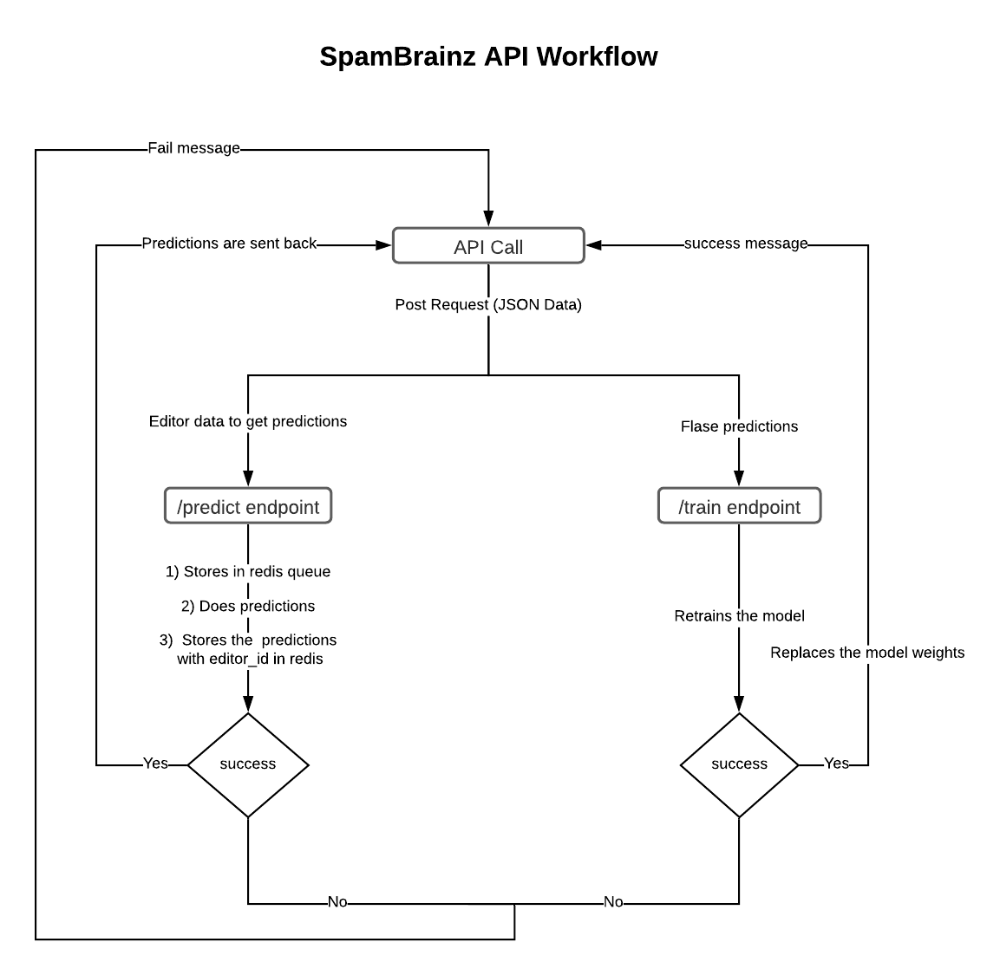

# SpamBrainz API
An API to classify editor account using LodBrok(keras model) in the backend. Also has an option to retrain the model for future enhancement by taking incorrect predictions into consideration as per SpamNinja feedback.

### Steps to run the API

1) Install all the dependencies needed in virtual environment: 

```
        pip install -r requirements.txt
```
2) In spambrainz folder, set certain environmental variables in the terminal to run the API:
```
         $ export FLASK_APP=sb_api.py
         $ export FLASK_DEBUG=1 # only for development purpose
         $ export FLASK_RUN_PORT=4321 # the api requests are sent to this port number
```

3) Install Redis: 
```
        $ wget http://download.redis.io/redis-stable.tar.gz
        $ tar xvzf redis-stable.tar.gz
        $ cd redis-stable
        $ make
        $ sudo make install
```
4) Run redis separate terminal to store the get the data sent to SB_API
```  
        $ redis-server 
```

5) With this all the dependencies are set to run the server, now simply run the server by
```  
        $ flask run
```

This should run the API in the specified port in debug mode




The detailed internal functioning of API is present [here](spambrainz/app/README.md)

The request used, their details and the output are present [here](spambrainz/README.md)

### Dockerization for testing

- Having a docker container of the application would help for further testing with different datasets.

- To do this, one must have docker installed in your local machine. 

- A Redis Docker container instance is needed to be used by our application. To run a Redis Docker instance, run the following command:


```
        $ docker run --name rdb -p 6379:6379 redis 
        # if already present remove it using
        $ docker rm rdb

```

- After Redis is running go to another folder and run the Dockerfile to start the API.

- After this run the following command in spambrainz directory to build the docker image.

```
        $ docker build -t spambrainz:latest .
```

- Now, you have the build ready with you. Run the build with the following command

```
        $ sudo docker run -it  spambrainz
```